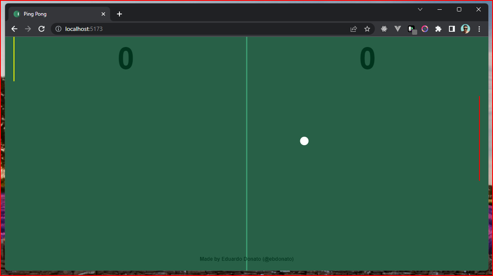

# Ping-Pong Vanilla Js

## Description

This project is based on a practice from [Dev Samurai](https://devsamurai.com.br/) course.



## How to Run or Build

To preview the project, run the following command:

```bash
npm i
npm run dev
```

To build the project, run the following command:

```bash
npm i
npm run build
```

This will create a `dist` folder with the assets of the project.
